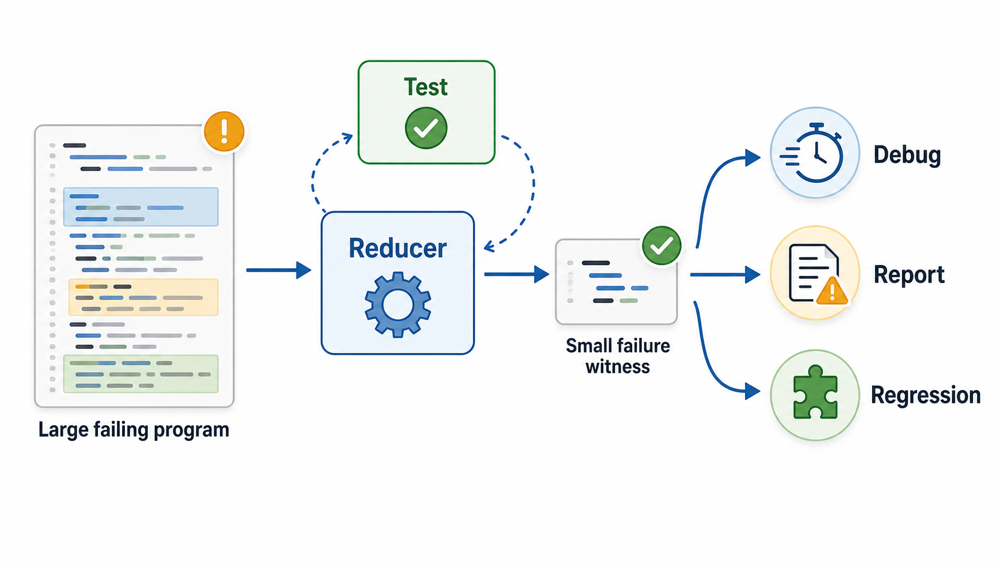

# Welcome {.unnumbered}

```{=html}
<div class="hero">
  <div class="hero-eyebrow">Open Book &middot; Free to Read</div>
  <h1 class="hero-title">Program Reduction 101</h1>
  <p class="hero-subtitle">
    Turn a 3,000-line failing program into a 26-line bug report.
    A practical and research-oriented guide to program reduction,
    from Delta Debugging to Perses and syntax-guided reducers.
  </p>
  <div class="hero-buttons">
    <a href="chapters/preface.html" class="btn-hero-primary">Start Reading &rarr;</a>
    <a href="https://github.com/uw-pluverse/perses" class="btn-hero-secondary">Try Perses on GitHub</a>
  </div>
  <div class="terminal-demo">
    <div>
      <span class="t-prompt">$</span>
      <span class="t-cmd"> java -jar perses_deploy.jar</span>
      <span class="t-flag"> \</span>
    </div>
    <div>
      <span class="t-cmd">&nbsp;&nbsp;&nbsp;&nbsp;--test-script</span>
      <span class="t-flag"> test.sh</span>
      <span class="t-cmd"> --input-file</span>
      <span class="t-flag"> failure.c</span>
    </div>
    <div>&nbsp;</div>
    <div><span class="t-cmt"># Perses runs...</span></div>
    <div><span class="t-out">Reduced: 3,225 lines &rarr; 26 lines &nbsp;(99.2% smaller)</span></div>
  </div>
</div>
```

```{=html}
<p class="landing-h">What Is Program Reduction?</p>
<p class="landing-sub">The missing step between finding a bug and understanding it.</p>
```

A compiler fuzzer hands you a program with thousands of lines.
The program crashes the compiler, but almost all of it is irrelevant.
Before a developer can understand the bug, file a useful report, or add a regression test,
someone has to shrink that program — without losing the failure.

That is **program reduction**. It turns *"this generated program breaks the compiler"*
into *"this small program explains the bug."*

The same problem appears everywhere structured inputs can fail:
interpreters, static analyzers, theorem provers, database engines, build systems.
In each case, the goal is not only to reproduce the failure,
but to find a small artifact that still explains it.

```{=html}
<figure class="landing-illustration">
  
  <figcaption>
    Program reduction keeps the failure while removing everything that does not help explain it.
  </figcaption>
</figure>
```

```{=html}
<hr class="landing-divider">
<p class="landing-h">What You Will Learn</p>
<p class="landing-sub">Practice, theory, and research — all connected through Perses.</p>

<div class="features-grid">

  <div class="feature-card">
    <div class="feature-icon">&#9881;&#65039;</div>
    <div class="feature-title">Practical Workflow</div>
    <p class="feature-desc">
      Run your first Perses reduction in Chapter&nbsp;4. Write interestingness
      tests, inspect results, and build real debugging workflows.
    </p>
  </div>

  <div class="feature-card">
    <div class="feature-icon">&#128336;</div>
    <div class="feature-title">Core Algorithms</div>
    <p class="feature-desc">
      Understand Delta Debugging, Hierarchical Delta Debugging, and how
      Perses uses grammar structure to search more efficiently.
    </p>
  </div>

  <div class="feature-card">
    <div class="feature-icon">&#128218;</div>
    <div class="feature-title">Research Landscape</div>
    <p class="feature-desc">
      Navigate the Perses research family: minimality, pairwise reduction,
      caching, LLM-guided reduction, and transformation power.
    </p>
  </div>

  <div class="feature-card">
    <div class="feature-icon">&#127760;</div>
    <div class="feature-title">Language-Agnostic</div>
    <p class="feature-desc">
      Reduce C, Rust, Java, Python, SMT-LIB, SQL, and more.
      Understand how grammar support extends Perses to new languages.
    </p>
  </div>

</div>
```

```{=html}
<hr class="landing-divider">
<p class="landing-h">Who Should Read This</p>
<p class="landing-sub">Choose a path based on what you need first.</p>

<div class="audience-grid">

  <div class="audience-card">
    <div class="audience-role">&#127891;&nbsp; Students</div>
    <p class="audience-desc">
      Learning compilers, software testing, fuzzing, or debugging.
      Start at Chapter&nbsp;1 and read sequentially.
    </p>
  </div>

  <div class="audience-card">
    <div class="audience-role">&#128295;&nbsp; Software Developers</div>
    <p class="audience-desc">
      Need to shrink large failure-inducing inputs into useful bug reports.
      Jump straight to Chapter&nbsp;4.
    </p>
  </div>

  <div class="audience-card">
    <div class="audience-role">&#128202;&nbsp; Researchers</div>
    <p class="audience-desc">
      Entering the program-reduction literature.
      Read the Perses Family chapter and the open problems chapter.
    </p>
  </div>

</div>
```

```{=html}
<hr class="landing-divider">
<p class="landing-h">What You Will Be Able to Do</p>
<p class="landing-sub">Concrete skills by the end of the book.</p>

<ul class="outcome-list">
  <li>Reduce a large failure-inducing input while preserving the target behavior</li>
  <li>Write an interestingness test that defines what Perses should keep</li>
  <li>Judge whether a reduced result is useful as a bug report, regression test, or research artifact</li>
  <li>Explain how Perses connects Delta Debugging, syntax-guided reduction, and the broader research family</li>
  <li>Navigate the open problems in program reduction and where research is heading</li>
</ul>
```

```{=html}
<hr class="landing-divider">
<p class="landing-h">Why Perses</p>
```

[Perses](https://github.com/uw-pluverse/perses) is the center of this book because it
captures a central insight of modern program reduction: programs are not just text, but
structured artifacts with syntax.
By using grammar information, Perses can search for smaller candidates while avoiding
reductions that break the input before it reaches the target failure.

The original [Perses paper](https://cs.uwaterloo.ca/~cnsun/public/publication/icse18/)
introduced syntax-guided program reduction at ICSE 2018, led by
[Prof. Chengnian Sun](https://cs.uwaterloo.ca/~cnsun/public/index.html) and collaborators.
Later Perses-family work at the University of Waterloo, with Prof. Sun's
students and collaborators including Yongqiang Tian, Zhenyang Xu, Mengxiao
Zhang, Xueyan Zhang, Yiwen Dong, Jia Le Tian, Xintong Zhou, and Yiran Wang,
extended the idea through minimality,
pairwise reduction, caching, LLM-aided reduction, lexical guidance, and
syntax-guided transformations.
For details, see [The Perses Family](chapters/07-the-perses-family.qmd) and
[Citing This Book and Perses](chapters/citing-this-book-and-perses.qmd).

```{=html}
<hr class="landing-divider">
```

## About This Book Project

This book project was initiated by [Dr. Yongqiang Tian](https://yqtian.com/), one of
Prof. Chengnian Sun's first students at Waterloo and now a Lecturer (Assistant Professor
equivalent) at Monash University. Yongqiang has benefited deeply from Prof. Sun's
supervision and mentorship, and this book reflects that intellectual lineage.
